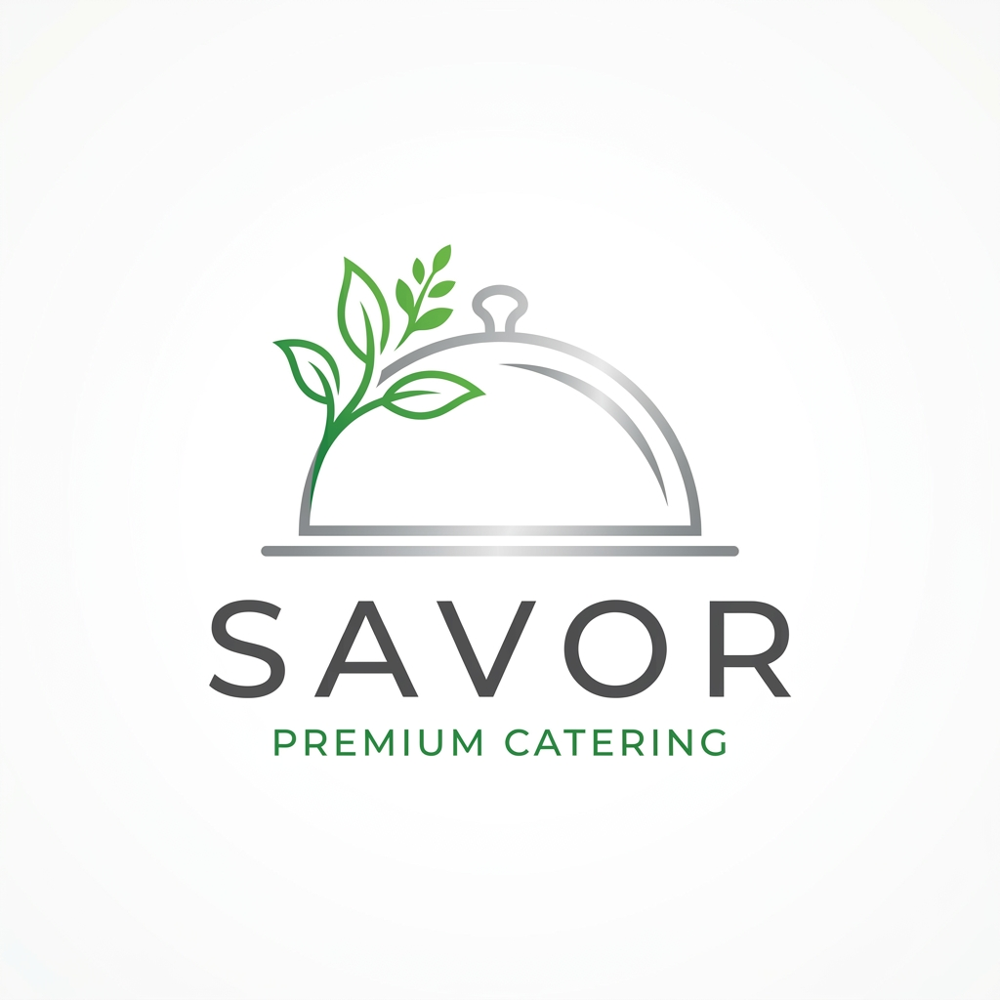

# 🍽️ Savor Catering | Professional Portfolio Demo

[](https://reactjs.org/)
[](https://www.typescriptlang.org/)
[](https://vitejs.dev/)
[](https://capacitorjs.com/)

**Savor Catering** is a high-performance, mobile-first catering management application. Originally developed as a custom SaaS solution for a private client, this version has been repurposed into a standalone, local-only demo to showcase modern web development expertise.

---

## ✨ Key Features

- **📱 Mobile-First Design**: Optimized for a native app-like experience using Capacitor and Tailwind CSS.
- **🌐 Multi-Language Support**: Fully localized in **English** and **Tamil** with a seamless language toggle.
- **⚡ Offline-First Architecture**: Utilizes browser `localStorage` for data persistence, allowing the app to function without a backend.
- **📦 Intelligent Menu System**: Interactive menu with categories, dish varieties, and search functionality.
- **🛒 Group Ordering**: Advanced order selection logic with support for group-based cart management.
- **📜 Order History**: Local tracking of past orders with detailed breakdowns.
- **🛠️ Admin Dashboard**: Full CRUD capabilities for categories and dishes, including drag-and-drop reordering.

---

## 🛠️ Tech Stack

- **Frontend**: React (v19), TypeScript, Tailwind CSS
- **State Management**: Zustand
- **Icons**: Lucide React
- **Build Tool**: Vite
- **Mobile Foundation**: Ionic Capacitor
- **Persistence**: Browser LocalStorage (Mocked for Demo)

---

## 📸 Preview

<div align="center">
  
  <p><em>Premium, modern branding and intuitive UI/UX.</em></p>
</div>

---

## 🚀 Getting Started

To run this project locally:

1. **Clone the repository**:
   ```bash
   git clone https://github.com/vincentjebinv/savor-catering.git
   ```

2. **Install dependencies**:
   ```bash
   npm install
   ```

3. **Run the development server**:
   ```bash
   npm run dev
   ```

4. **Build for production**:
   ```bash
   npm run build
   ```

---

## 👨‍💻 Author

**Vincent**
*Professional Web & Mobile Developer*

If you are interested in a custom solution for your business or would like to collaborate on a project, let's connect:

- **📸 Instagram**: [@vincent.dev.in](https://instagram.com/vincent.dev.in)
- **📧 Email**: [vincenvenkadesan@gmail.com](mailto:vincenvenkadesan@gmail.com)

---

## 📄 License

This project is licensed under the MIT License - see the [LICENSE](LICENSE) file for details.

---

> [!NOTE]
> This repository is a technical showcase for my professional portfolio. It contains no sensitive client data and is intended for demonstration purposes only.
